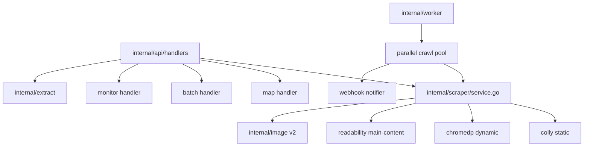

# Tomoshibi v2 — Design Doc

**Date:** 2026-08-01
**Status:** Approved (Approach 1 — sprint-based, all five sprints)
**Scope constraint:** No LLM dependency ever. All intelligence is deterministic.

---

## 1. Goal

Make Tomoshibi faster, crawl better, fetch images better, and add competitive new features — while staying self-hosted, hobby-tier friendly, and zero-external-dependency.

## 2. Evidence Base

- **Code audit** of `internal/scraper`, `internal/image`, `internal/worker`, `internal/domain`, `internal/api`.
- **Live dogfooding** against the Fly deployment (image extraction returned 48px avatars instead of hero images; cache verified working; smart mode ~2s on react.dev).
- **Competitive research** (Firecrawl v2.11 changelog, anti-bot state-of-the-art, content extraction techniques).

### Key findings (each maps to work below)

| # | Finding | Sprint |
|---|---------|--------|
| 1 | Full HTML (nav/ads/footer) → markdown; no main-content extraction | A |
| 2 | Cache key ignores `ImageFormat`, `MaxImages`, `ScreenshotOpts` | A |
| 3 | `ScreenshotOptions` struct defined but never used | A |
| 4 | Chromedp hardcodes `CinderBot/1.0` UA (violates own anti-detect rule) | A |
| 5 | Image blob fetch is a serial loop | A |
| 6 | Extractor: no srcset, no `data-src` lazy-load, no `<picture>`, no dimensions | B |
| 7 | `DefaultQuality` constant never used; no resize/re-encode | B |
| 8 | Crawl is strictly sequential BFS | C |
| 9 | No retry policy, no include/exclude patterns, no webhook | C |
| 10 | No `/v1/map`, no batch scrape, no page actions | D |
| 11 | No structured extraction, summary, change tracking, PII redaction | E |
| 12 | No API-key auth / rate limiting (Phase 4 unfinished) | E |

## 3. Architecture

Stays hexagonal: new logic goes into `internal/domain` (interfaces + types), implementations in the existing feature packages. One new package is added: `internal/extract` (deterministic extraction + summary). Monolith mode unchanged.



## 4. Sprint Designs

### Sprint A — Core Quality

1. **Main-content extraction** — `github.com/go-shiori/go-readability` runs on raw HTML *before* `html-to-markdown` in both colly and chromedp paths. On readability failure, fall back to full-document conversion (never fail the scrape). Metadata gains `title`, `excerpt`, `byline`, `site_name`.
2. **Cache key fix** — SHA-256 of the JSON-marshaled full `ScrapeOptions` + URL replaces the current 4-field key. Legacy keys simply miss and get overwritten.
3. **ScreenshotOptions implemented** — `Width/Height/FullPage/Format/Quality/WaitSelector` honored in chromedp (`page.CaptureScreenshot` with `CaptureBeyondViewport` for full-page; format png/jpeg; quality 1–100; optional `chromedp.WaitVisible(WaitSelector)`).
4. **UA rotation in chromedp** — per-tab `gofakeit.UserAgent()` via `Network.SetUserAgentOverride` (allocator keeps a realistic default).
5. **Parallel image blob fetch** — `golang.org/x/sync/errgroup` with semaphore (default 5 concurrent), preserving result order; individual failures degrade gracefully (log + skip, as today).
6. **Browser recycling** — allocator restarts after N scrapes (env `CHROME_RECYCLE_AFTER`, default 100) to bound Chrome memory leaks; recycle is serialized behind a mutex and swaps the allocator atomically.

### Sprint B — Image Engine v2

1. **Extractor** — additionally parses: `srcset`/`sizes` (pick largest candidate), lazy-load attrs (`data-src`, `data-lazy-src`, `data-original`), `<picture><source srcset>`, inline `style="background-image"`, `link rel=image_src`. Next/image-style optimizer URLs are unwrapped to their origin `url=` param when present.
2. **Dimension sniffing** — `image.DecodeConfig` on the first bytes fetched (via `io.LimitReader`, 512KB cap) gives width/height/format without full decode; used when blob transport is on or `include_dimensions` requested.
3. **Quality scoring** — rank: og:image > twitter > hero (largest dimension/above-fold heuristic) > content > avatar/icon (small dims, `logo|icon|avatar|sprite` in URL). `max_images` takes the top-N after ranking, not first-N in DOM order.
4. **Optional processing** — `image_process: {format: "webp"|"jpeg", max_width: N, quality: N}` re-encodes via `golang.org/x/image` (activates the dead `DefaultQuality`). Off by default.

### Sprint C — Crawl v2

1. **Parallel worker pool** — N workers (default 4, env `CRAWL_CONCURRENCY`, cap 10) pull from a shared BFS queue; results appended under mutex. Same `limit`/`maxDepth` semantics.
2. **Per-domain politeness** — min interval between requests to the same host (default 1s, env `CRAWL_DOMAIN_DELAY`), enforced with a per-host token bucket.
3. **Retry policy** — in-task retry with exponential backoff (max 2) for 5xx/network errors; 4xx recorded as failed immediately, never retried (asynq `MaxRetry` stays for infra failures).
4. **Include/exclude patterns** — `include_paths` / `exclude_paths` arrays of glob patterns (`/blog/*`) matched against URL path; exclusion wins.
5. **Signed webhook** — `webhook_url` + `webhook_secret`; on completion POST the `CrawlResult` JSON with `X-Tomoshibi-Signature: sha256=<hmac>`; 3 delivery attempts with backoff; failures recorded in task result.

### Sprint D — Discovery & Endpoints

1. **`POST /v1/map`** — fetch `/robots.txt` → declared sitemaps → `sitemap.xml` (recursive sitemap index support, cap 5k URLs); if none, one-level link discovery from the seed. Response: `{url, count, links:[{url, depth, source}]}` with `search` substring filter param.
2. **`POST /v1/batch/scrape`** — `{urls: [...]}` (cap 20) enqueues one asynq task per URL into the `default` queue; returns `{batch_id, tasks:[{id,url}]}`; `GET /v1/batch/:id` aggregates states via inspector. Batch metadata stored in Redis (7d TTL).
3. **Page actions** — `actions: [{type, ...}]` executed in order before HTML capture (dynamic mode only): `wait_ms`, `wait_selector`, `scroll_down`/`scroll_to_bottom` (with lazy-load settle loop), `click`, `screenshot`. Static mode returns `400` if actions present.

### Sprint E — Intelligence (no LLM) + Hardening

1. **Deterministic JSON extraction** — `extract_schema: {fieldName: {"selector": "h1", "attr": "text|href|src|html", "multiple": false}}` evaluated with goquery against raw HTML; result in `extracted` field. (Firecrawl-deterministicJson-style, minus the LLM.)
2. **Summary format** — `formats: ["summary"]` (or `summary=true`) returns an extractive summary: readability excerpt if present, else top-N sentences scored by term frequency/position (default 5 sentences, `summary_sentences` param).
3. **Change tracking + monitor** — `POST /v1/monitor` `{url, interval_seconds (min 3600), webhook_url?, formats?}` → asynq recurring task (via `@every`-style scheduler entry registered at worker boot) scrapes, hashes markdown (SHA-256), compares to stored hash in Redis; on change stores new snapshot + fires webhook `{changed: true, hash_old, hash_new, changed_at}`. `GET /v1/monitor/:id` status, `DELETE /v1/monitor/:id` removes.
4. **PII redaction** — `redact_pii: true` masks emails, phone numbers, and credit-card-shaped numbers in markdown/summary via vetted regexes (documented patterns, test-covered).
5. **Cleaner defaults** — `block_ads: true` and `remove_base64_images: true` default-on options: readability already strips most boilerplate; additionally drop known ad/tracker selectors (`.ad, [class*="advert"], iframe[src*="doubleclick"]…`) and inline `data:` images before conversion. Both individually disable-able.
6. **Auth + rate limiting** — `API_KEYS` env (comma-separated); if set, `X-API-Key` header required on `/v1/*` (401 otherwise). If unset → open (current behavior, documented). Per-key sliding-window rate limit in Redis (default 60 req/min, env `RATE_LIMIT_RPM`); no-Redis deployments get an in-memory limiter.

## 5. Data Flow (scrape, post-v2)

```
request → cache lookup (full-options key)
  → static/dynamic/smart engine → raw HTML
  → readability main-content → (block_ads strip)
  → actions (dynamic only, before capture)
  → markdown / summary / extract_schema / pii redact
  → images v2 (extract → rank → [parallel fetch+sniff+process])
  → screenshot (full options)
  → cache store (gzip, 7d) → response
```

## 6. Error Handling

- Readability failure → fall back to full-document conversion (never 500).
- Per-image fetch failure → skip image, keep result (current behavior preserved).
- Webhook delivery failure → recorded in task result, does not fail the crawl.
- Monitor scrape failure → logged, hash unchanged, next tick retries.
- Actions on static mode → 400 with clear message.
- Auth missing/disabled → open mode documented in README.

## 7. Testing

- Table-driven unit tests per sprint (readability fallback, cache-key uniqueness, srcset picking, scorer ranking, retry skip-4xx, pattern matching, HMAC webhook signature, redaction regexes, summary scoring).
- Integration: `httptest` + `gin.TestMode` for new endpoints; monitor test uses short interval + in-memory Redis miniredis.
- `make check` (gofmt, vet, staticcheck, tests, `-race`) green before each sprint merge.

## 8. Docs & API Spec

- Regenerate `internal/api/docs/swagger.json|yaml` via `swag init` after each sprint's handlers land.
- Update `docs/guides/API_REFERENCE.md` (new endpoints/params), `docs/guides/ARCHITECTURE.md` (pipeline diagram), `docs/features/` (one page per new feature family: images-v2, crawl-v2, map, monitor, extraction).
- Update `README.md` feature list, `plan/todos.md` (Phase 4/5 check-offs), `.env` example with all new env vars.

## 9. New Environment Variables

| Var | Default | Purpose |
|-----|---------|---------|
| `CRAWL_CONCURRENCY` | 4 | Parallel crawl workers |
| `CRAWL_DOMAIN_DELAY` | 1s | Per-host politeness |
| `CHROME_RECYCLE_AFTER` | 100 | Browser recycle threshold |
| `API_KEYS` | (empty=open) | Comma-separated API keys |
| `RATE_LIMIT_RPM` | 60 | Per-key requests/min |
| `WEBHOOK_TIMEOUT` | 10s | Webhook delivery timeout |
